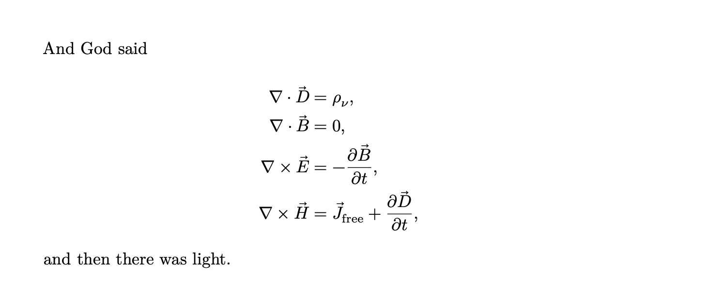

### Inline math

Anything between two `$` characters will be treated as TeX math. For an excellent reference on what is possible here, have a look at the [TeX reference card](https://www.math.brown.edu/johsilve/ReferenceCards/TeXRefCard.v1.5.pdf).

The opening \$ must have a non-space character immediately to its right, while the closing \$ must have a non-space character immediately to its left, and must not be followed immediately by a digit. Thus, `$20,000` and `$30,000` won’t parse as math. If for some reason you need to enclose text in literal `$` characters, escape them with a blackslash and they won’t be treated as math delimiters.

```markdown
Here is some text and here is some math: $E = mc^2$.
```

### Display math

For display math, use `$$` delimiters. In this case, the delimiters may be separated from the formula by whitespace. However, there can be no blank lines betwen the opening and closing delimiters.

```markdown
$$ 1 + 2 = 3 $$
```

### Aligned equations

To get aligned equations, you can either write inline LaTeX and use it's provided `align` environment. This might however make it difficult for MDoc to keep track of equation numbers and cross-referencing, so the recommendation is to use the `aligned` environment - provided by TeX - inside a `$$` delimited display math context. Consider the following example:

```markdown
And God said

$$ \begin{aligned}
    \nabla \cdot \vec D &= \rho_\nu, \\
    \nabla \cdot \vec B &= 0, \\
    \nabla \times \vec E &= -\frac{\partial \vec B}{\partial t}, \\
    \nabla \times \vec H &= \vec J_\text{free} + \frac{\partial \vec D}{\partial t},
\end{aligned} $$

and then there was light.
```

This will get rendered as:


